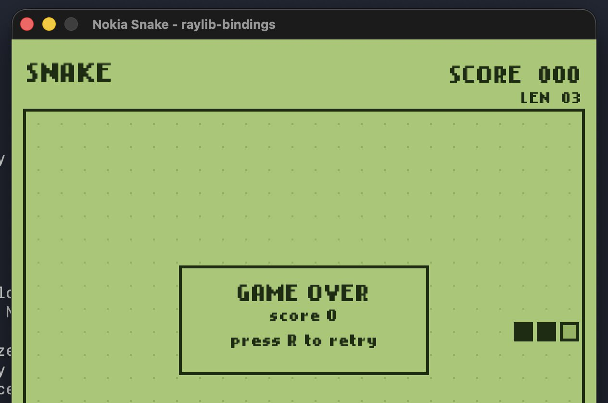

# Nokia-Style Snake Game

A small Nokia-style snake game written in Ruby that exists purely as a demo for the Raylib 6.0-targeting [raylib-bindings](https://github.com/vaiorabbit/raylib-bindings) gem prior to its inclusion in https://rubyweekly.com/

It requires CRuby (TruffleRuby does [not work](https://github.com/truffleruby/truffleruby/issues/3835) yet) and the `raylib-bindings` gem (`gem install raylib-bindings`). Then you just `ruby snake.rb`.

Controls are arrows or WASD, space to pause/unpause, R to restart, and Esc to quit.

## Basic features demonstrated

- `InitWindow` / `WindowShouldClose` / `BeginDrawing` / `EndDrawing` lifecycle
- `IsKeyPressed` for input
- `LoadFontEx` + `DrawTextEx` for a custom bitmap font
- `InitAudioDevice` and a hand-built `Wave` of 16-bit PCM samples loaded via `LoadSoundFromWave`, so the eat and game-over blips are generated in code with no audio assets.

## Credits

The `nokiafc22.ttf` font is "Nokia Cellphone FC" by Zeh Fernando, available at <https://www.dafont.com/nokia-cellphone.font>.
